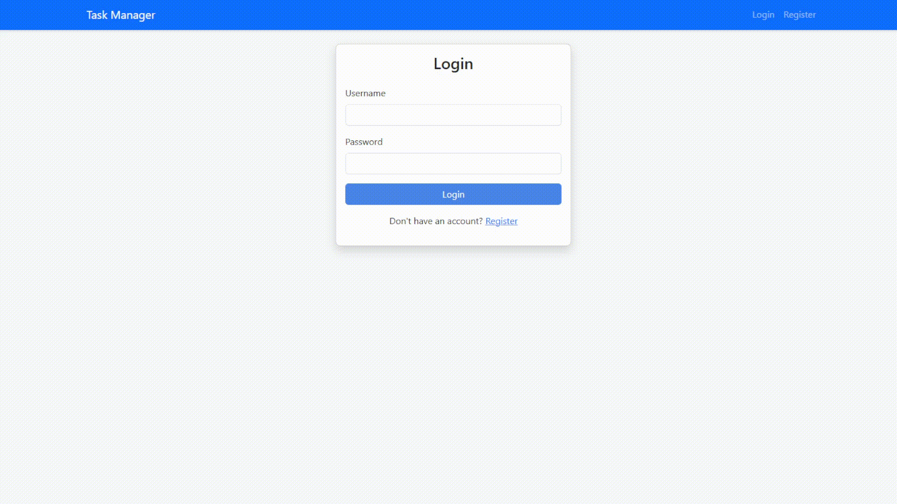

# Task Manager Application

A full-stack web application for managing tasks with user authentication.

## Overview

This Task Manager is a web application that allows users to create, view, update, and delete tasks. The application includes user authentication with JWT tokens, ensuring that users can only access their own tasks.

## Preview



## Features

- User authentication (register, login, logout)
- JWT-based authorization
- Task management (create, read, update, delete)
- Responsive design using Bootstrap

## Tech Stack

### Backend

- Java 8+
- Spring Boot 2.7.5
- Spring Data JPA
- Spring Security
- PostgreSQL
- JWT for authentication

### Frontend

- React 17.0.2
- React Router 5.2.0
- Bootstrap 5.0.0
- HTML/CSS

## Installation & Setup

### Prerequisites

- Java JDK 8 or higher
- Node.js and npm
- PostgreSQL

### Database Setup

1. Create a PostgreSQL database named `taskdb`:

```sql
CREATE DATABASE taskdb;
```

2. Configure database connection in `backend/src/main/resources/application.properties`:

```properties
spring.datasource.url=jdbc:postgresql://localhost:1433/taskdb
spring.datasource.username=postgres
spring.datasource.password=user
```

### Backend Setup

1. Navigate to the backend directory:

```bash
cd backend
```

2. Build the project using Maven:

```bash
mvn clean install
```

3. Run the Spring Boot application:

```bash
mvn spring-boot:run
```

The backend server will start at http://localhost:8080

### Frontend Setup

1. Navigate to the frontend directory:

```bash
cd frontend
```

2. Install the dependencies:

```bash
npm install
```

3. Start the development server:

```bash
npm start
```

The frontend application will start at http://localhost:3000

## API Documentation

### Authentication Endpoints

#### Register User

- **URL**: `/api/auth/register`
- **Method**: `POST`
- **Request Body**:
  ```json
  {
    "username": "string",
    "password": "string"
  }
  ```
- **Success Response**: HTTP 200
  ```json
  {
    "message": "User registered successfully"
  }
  ```
- **Error Response**: HTTP 409 (Conflict) or 500 (Server Error)

#### Login

- **URL**: `/api/auth/login`
- **Method**: `POST`
- **Request Body**:
  ```json
  {
    "username": "string",
    "password": "string"
  }
  ```
- **Success Response**: HTTP 200
  ```json
  {
    "token": "JWT_TOKEN",
    "username": "string"
  }
  ```
- **Error Response**: HTTP 401 (Unauthorized) or 500 (Server Error)

### Task Endpoints

All task endpoints require authentication. Include the JWT token in the Authorization header.

#### Get All Tasks

- **URL**: `/api/tasks`
- **Method**: `GET`
- **Headers**:
  ```
  Authorization: Bearer JWT_TOKEN
  ```
- **Success Response**: HTTP 200
  ```json
  [
    {
      "id": "number",
      "title": "string",
      "description": "string"
    }
  ]
  ```
- **Error Response**: HTTP 401 (Unauthorized) or 500 (Server Error)

#### Create Task

- **URL**: `/api/tasks`
- **Method**: `POST`
- **Headers**:
  ```
  Authorization: Bearer JWT_TOKEN
  Content-Type: application/json
  ```
- **Request Body**:
  ```json
  {
    "title": "string",
    "description": "string"
  }
  ```
- **Success Response**: HTTP 200
  ```json
  {
    "id": "number",
    "title": "string",
    "description": "string"
  }
  ```
- **Error Response**: HTTP 401 (Unauthorized) or 500 (Server Error)

#### Update Task

- **URL**: `/api/tasks/{id}`
- **Method**: `PUT`
- **Headers**:
  ```
  Authorization: Bearer JWT_TOKEN
  Content-Type: application/json
  ```
- **URL Parameters**: `id=[long]`
- **Request Body**:
  ```json
  {
    "title": "string",
    "description": "string"
  }
  ```
- **Success Response**: HTTP 200
  ```json
  {
    "id": "number",
    "title": "string",
    "description": "string"
  }
  ```
- **Error Response**: HTTP 401 (Unauthorized), 404 (Not Found), or 500 (Server Error)

#### Delete Task

- **URL**: `/api/tasks/{id}`
- **Method**: `DELETE`
- **Headers**:
  ```
  Authorization: Bearer JWT_TOKEN
  ```
- **URL Parameters**: `id=[long]`
- **Success Response**: HTTP 200
  ```
  "Task deleted successfully"
  ```
- **Error Response**: HTTP 401 (Unauthorized), 404 (Not Found), or 500 (Server Error)

## Security Notes

- Passwords are currently stored in plain text. In a production environment, passwords should be hashed using a secure algorithm like BCrypt.
- The JWT secret key should be changed in a production environment and stored securely as an environment variable.
- CORS is configured to allow requests only from http://localhost:3000. Update this for your production environment.

